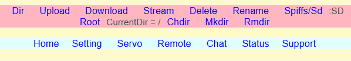
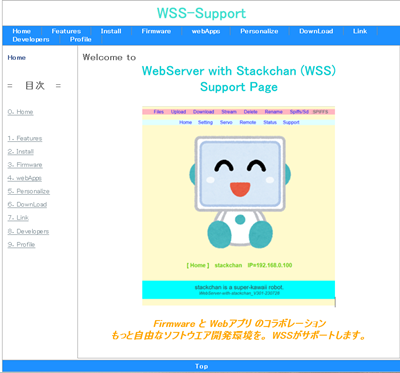
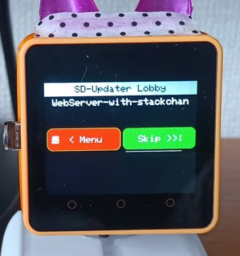
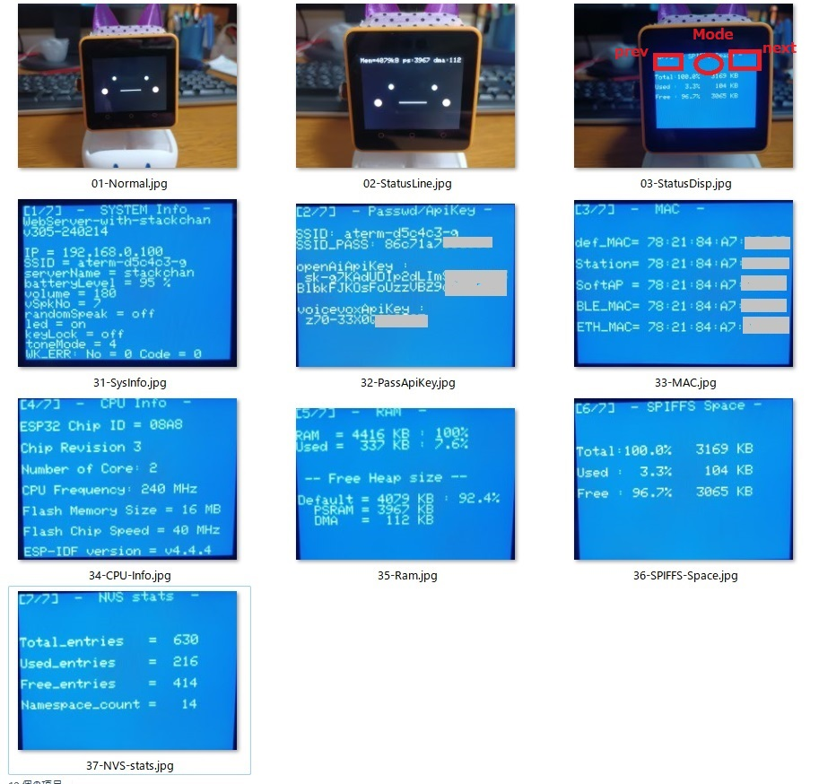
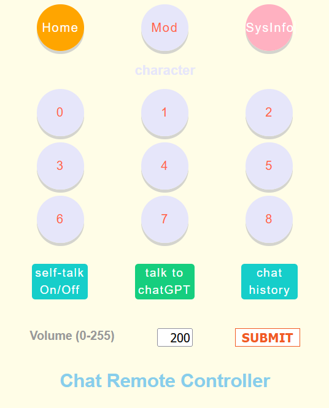

# WebServer-with-stackchan (WSS)
## v3.09a（変更）
ステータス表示(StatusDisp)が正しく表示されないBug修正
  

## Features（特徴）
<b>(1).ファイル管理機能つき、WebServer</b> 
SPIFFS/SDにPCから直接ファイルをアップロードまたは、PCにファイルをダウンロードすることが可能になりました。

 
 

<b>ファイル管理機能</b> 
Dir of SPIFFS/SD file system 
Upload a file to SPIFFS/SD from PC  
Download a file from SPIFFS/SD to PC  
Stream a file to PC browser 
Delete a file in SPIFFS/SD 
Rename a file in SPIFFS/SD 
Spiffs/Sd change file system 
Status　of m5Stack system information 

<b>SD folder function (暫定版)</b> 
Root  : change directory to Root 
Chdir. : change directory 
Mkdir : make directory 
Rmdir: remove directory 
 

<b>(2).Webアプリとファームウエアが連携したスタックチャン・ソフトウエア。</b> 
設定・サーボ調整・リモコンのオールインワンのソフトを提供。 
スマートフォンとPC両方に対応しています。 
Webアプリは、html、styleSheet、javaScript、画像ファイルなどを使用して作成できます。 
 

<b>(3).階層構造</b> 
ソフトウエアを開発するにあたり、開発効率、拡張性とメンテナンスを考慮した設計をしました。 
各階の役割は次のようになっています。 
４階： ｗebApps: リモコン、Servo調整、設定などのWebアプリ（SPIFFS） 
３階： webApi: 外部とのインターフェース 
２階： module: ChatGPT,Timer,Servoなど、ファームウエアで提供のモジュール 
１階： base1: Avatar,TTS,STTなど、スタックチャンの基となる表情・話す・聞くなどの部分 
０階： base0: M5Stackのハード依存の部分(Button,LED,Server,WiFiなど) 
 

<b>(4).module(モジュール)形式で、機能の追加・削除が可能。</b> 
現在ファームウエアとして３個のモジュールの内蔵アプリを提供。 
・　chatGPT　（AiStackchan２相当） 
・　Timer 
・　Servo 
 

## 必要なもの
・<b>本体 - M5Stack Core2</b> （Core2 for Awsで動作確認しています） 
・<b>Servo（SG90、または互換サーボ)</b>： 「顔だけ」の場合は必要なし 
サーボ・ポートは、PortA,PortC両方に対応。設定で後から変更できます。  
・<b>SDカード</b> : 初回のWiFi接続時に使用します。 
通常は、SPIFFS内のファイルだけで運用することができますが、SDの情報がSPIFFSファイルより優先されます。緊急用にWiFiとApiKeyの設定ファイルは、SDに保存しておくことをお勧めします。  
・<b>OpenAiのApiKey</b> 
・<b>VOICEVOXのApiKey</b>  
ファームウエアを本体に書き込む為にPC上にどちらかの環境を整えてください。 
・<b>VsCodeの開発環境</b>　または、<b>M5Burner</b> 
 

## Support Page
下記リンクで、インストール手順などのサポートを行っています。 
https://nori.rdy.jp/wss/   　　　(WSS-Support) 

 
 

## M5Burner
M5Burnerで、ファームウエアを入手することもできます。 
（デバイス種類は「CORE2 & TOUGH」） 
 
 

## LICENSE

私が作成した部分のソフト(srcフォルダ以下:libフォルダは除く)は、[MIT license](LICENSE) です。 
ただし、"src/base00/wsServer.cpp"ファイルは、[ESP-File-Server-License](doc/ESP-File-Server-License.txt)　となります。 
ご自分の判断でご活用ください。 

イラストのライセンスは下記をご参照ください。 
  - [おきもくさんの公開物wiki] (https://okimoku.com/wiki/%E3%82%A4%E3%83%A9%E3%82%B9%E3%83%88)

 

## 参考リポジトリ
- [AI_StackChan2 (robo8080さん)](https://github.com/robo8080/AI_StackChan2)「MIT License」
- [M5Stack_Stack-chan_another_dimension(つゆきぱぱさん)](https://github.com/yakumo0623/M5Stack_Stack-chan_another_dimension)「MIT License」 
- [stack-chan-tester (タカオさん)](https://github.com/mongonta0716/stack-chan-tester)「MIT License」

- [m5stack-avatar(ししかわさん)](https://github.com/meganetaaan/m5stack-avatar)「MIT License」

- [ESP-File-Server(David Bird:UK)](https://github.com/G6EJD/G6EJD-ESP-File-Server)： [ESP-File-Server-License](doc/ESP-File-Server-License.txt)
  

## 「スタックチャン」について
「スタックチャン」は、[ししかわさん](https://github.com/meganetaaan)が公開しているオープンソースのプロジェクトです。 
https://github.com/meganetaaan/stack-chan
 
 

## 謝辞
このソフトを作成するにあたり、 

- AiStackChan2の開発者で、先進的な取り組みでスタックチャン界をリードしてくださる[robo8080](https://github.com/robo8080)氏に感謝いたします。 

- stack-chan-testerの開発者で、博識でいつも適切なアドバイスをして頂ける[タカオ](https://github.com/mongonta0716)氏に感謝いたします。 

- スタックチャン・コミュニティを様々な角度から暖かく支えてくれて、自由に使えるイラストをまとめてくれた[おきもく](http://okimoku.com/gallery/)氏に感謝いたします。 

他にも、たくさんの方々からアドバイスとアイデアを頂き、感謝いたしております。
  

## Author
[NoRi](https://twitter.com/NoRi230401)
 

## history

### Ver3.09a 2024-03-17
ステータス表示(StatusDisp)が正しく表示されないBug修正
  

### Ver3.08a 2024-02-25
RootCA変更による「わかりません」現象の解消。
  

### Ver3.08 2024-02-23
・初期設定で、SERVOはOFFに変更。(サーボなし使用) 
・SD-Updatar使用するBINファイルをSDに直接書込みする機能。 
（書込みに失敗することがあります。その時は、再起動してください）
 

### Ver3.07 2024-02-18
#### SD-Updater対応
 

立上げ時に SD-UpdaterのMenuに移行できるようしました。 
SD直下に、firmware（ファイル名"wss.bin"）をコピーしておくと、SD-Updater対応のアプリと切替えができるようになります。 
 

 

### Ver3.06a 2024-02-16
電源投入時の不具合対応のため緊急リリース。 
（根本原因は不明なのですが、とりあえず現象は解消した）
 

### Ver3.05 2024-02-14
#### <b>(1).ステータス表示(StatusDisp)</b> 
Ver304に引き続き、バッテリー・アイコンを拡張し、情報表示の機能をつけました。 
<b>画面上部の真中</b>をタッチすると、Normal, StatusLine, StatusDispの３つのModeを切替えます。 
<b>Normal</b> : 通常のスタックチャンの顔の表示 
<b>StatusLine</b> ：上１行を使い、バッテリー・アイコンを含めた７種類を選択できます。 
種類の選択は、画面上部の左(Prev)または、右(Next)で選ぶことができます。今回は、「メモリ残量」表示を追加しています。 
<b>StatusDisp</b> :　Avatarを停止して、全画面を使って情報表示をします。  
StatsuLineモードと同様に、画面上部の左右をタッチすると違う種類を選択することができます。
全部で７種類の情報があります。 

 
  

#### (2).その他
v304から、ソースにかなりの変更を加えました。 
・chatGPTの modelは、「gpt-3.5-turbo-0125」に変更 
・VOICEVOXのクラス化 
・階層間の機能分離の推進 
・PowerOn時のWiFi優先順位の見直し、などなど 
・HOME画面で使用できるイラストが、１０＋１(下の画像)で１１種類になりました。 
 

### Ver3.04 2024-01-06
(1).ステータス表示 
バッテリー・アイコンを拡張してステータス表示ができるよになりました。 
~~画面上部をタッチすると、６種のモード切替え・１０秒表示・常時表示OnOff機能を実行します。~~ 
(Ver3.05でStatusLine：７種類　および StatusDisp：７種類となりました。タッチ操作も変更されました)
 
(2).イラストのHome画面表示（自由に選択可） 
自由に使えるイラストをHome画面に表示できるようになりました。現在、ご提供いただいたイラスト９＋１(下の画像)の~~計１０種類~~ (Ver3.05で１１種類) のファイルが選択できます。 

### Ver3.03 2023-12-24　
・CORE2 V1.1対応 -- M5UnifiedライブラリV0.1.11使用
### Ver3.02 2023-12-22　
<b>(1).　Chat（Chat Remote Controller）Webアプリ</b> 
ChatGPTの操作に特化したリモコンを追加しました。 
・　キャラ変機能 
９つのキャラクター（ロールと音声）をワンタッチで変更 
・　チャット履歴表示（chat History） 

 

<b>(2).　暫定版：ＳＤファイル管理のフォルダ機能</b> 
Spiffs/SDで、ＳＤを選択するとフォルダ機能のメニューが出ます。 
Chdir, Mkdir, Rmdir　などが使えるようになりました。 
 

### Ver3.01 2023-08-23　
・first Release
 

