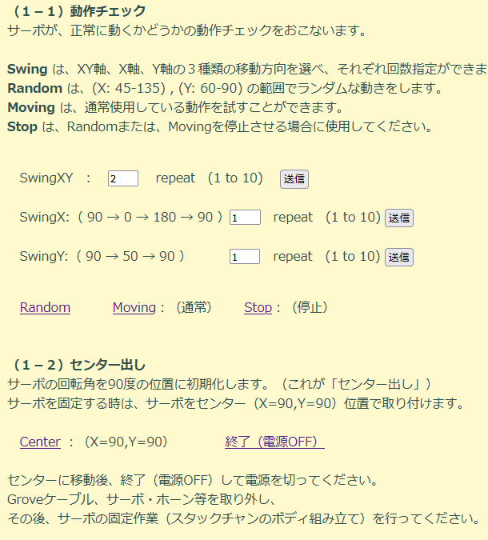
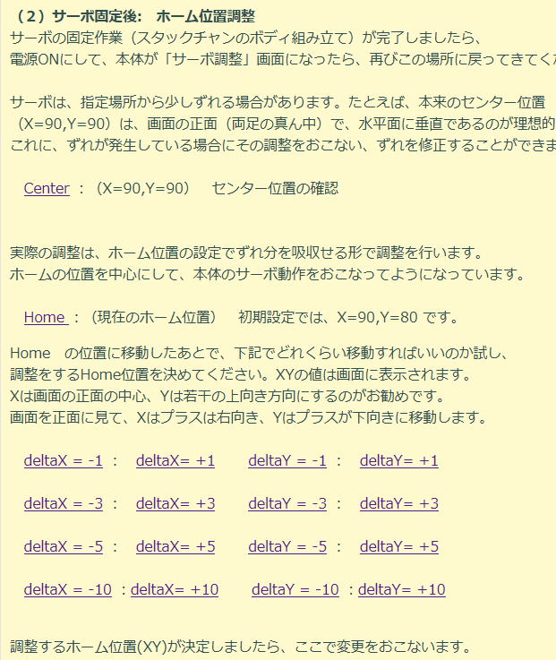
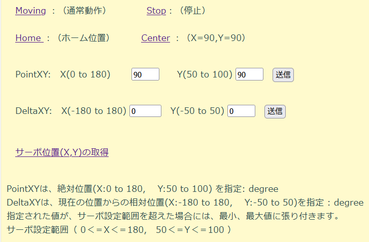
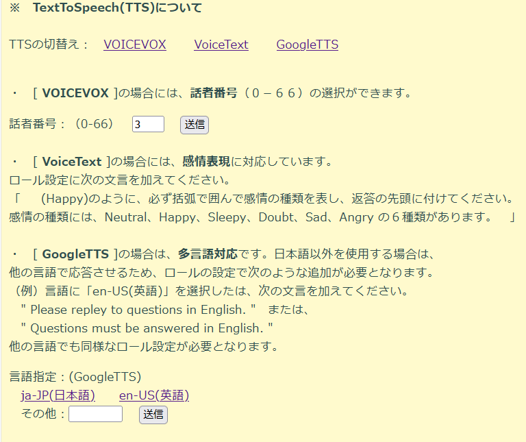
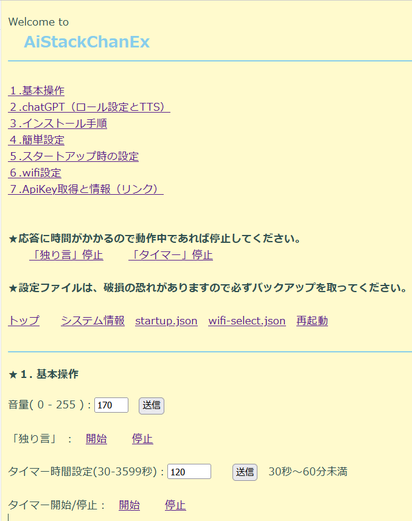

# AiStackChanEx

## 基本情報 
### Extended from  
次のソフトウエアを基にして作成しています。また、たくさんの人々から開発のアイデアを頂きました。ありがとうございます。　　
- stack-chan-tester                  : 2023-05-20 タカオさん  
- AI_StackChan2                      : 2023-05-31 Robo8080さん  
- M5Unified_StackChan_ChatGPT_Google : 2023-05-24 Robo8080さん  
- M5Unified_StackChan_ChatGPT_Global : 2023-04-28 Robo8080さん  
- ai-stack-chan_wifi-selector        : 2023-04-22 ひろきち821さん    
- M5Unified_StackChan_ChatGPT(v007)  : 2023-04-16 Robo8080さん    
- AI-StackChan-GPT-Timer             : 2023-04-07 のんちらさん    

---

### AiStackChanEx で、できること　（ＯＫ）   

- M5Unified_StackChan_ChatGPT(v007)とGlobal版の機能
- (New)**サーボ調整**
- SERVOコントロール(moving,Stop,Home,Center,XY指定など)
- ネットワークから全ての制御・機能の設定
- お好みのスタックチャンで起動できる      
 「顔だけ」、「省エネ」、「英語」、「いきなり独り言」、     
 「消音深夜デバック用」等のサンプル設定を提供(SAMPLEフォルダ)   
- いつでも３つのTTS切替え **VOICEVOX / VoiceText / GoogleTTS**
- 言語の切替え（画面表示・発音）：　日本語/英語モード
- WEBからスマホ・アプリ相当の設定・操作ができる
- システム情報の表示と取得
- サーボ・ポートは、portA / portC 両方に対応。
- サーボを使用しないときには、offにして電力消費を抑えることができる。
- 主な動作制御   
  Servoコントロール:　moving/stop/home/center/pointXY/deltaXY  
  keyLock: on/off  
  TTS切替え: VOICEVOX/voiceText/GoogleTTS  
  言語切替え:(日本語/英語)  
  voicevoxSpeakerNo: 0 - 66   
  randomSpeak ：on/off<br>
  toneMode(0-3):0:無音/1:ボタン押下/2:コマンド受信/3:両方<br>
  timer(30-3599)：30秒～60分未満    
  timer_Start/Stop：開始/停止  
  LED ： on/off  
  mute： on/off  
  Shutdown / Reboot  
- 主なスタートアップ時の指定  
 TTS選択: VOICEVOX/voiceText/GoogleTTS  
 voicevoxSpeakerNo: (-1 to 66) 、-1は最後の設定   
 randomSpeak：on/off  
 toneMode(0-3)  
 timer(30-3599)   
 mute：on/off    
 led：on/off   
 volume( -1 to 255 )、-1は最後の設定  　
- WiFi接続の拡張  
複数のAccessPointを登録し優先順に接続を試みる  
（自宅ルータ、テザリング、外出先での接続などが簡単）  
固定IPモードとDHCPの両方に対応  
- 従来ソフトと共通する問題の調査と改修     
・(New) サーボ初期化時の合否判定の論理修正  
・(New) Role複数設定　→ １つのRole設定  
・「わかりません」対策（エラー時の発声・表示を含む）  
・ コンパイル時のwarinig解消  
<br>

### AiStackChanExが、できないこと　（ＮＧ）   
- 「Aiスタックチャン2」に追加された、「本体の音声認識」

→　AiStackChanExでは、**スマホの音声認識**をご利用ください。
　　　
<br><br>

---


### 動作状況 および お知らせ　
- core2 ,core2 for AWS 対応。 SDカードが必要です。
- servoポートは、PortA および PortC 両方に対応
- TTSは、VOICEVOX、VoiceText、および GoogleTTSの３種類に対応
- VoiceText を使用の場合には、APIキーを取得していないと動きません。（個人の新規取得は現在できない）  
- VOICEVOX を使用の場合には、APIキーを取得し必ず登録してください。
- 使用ファイル(exWifi.json,exStartup.json,exApikey.json, index.html)は、exフォルダに雛形を用意しました。
- 上記ファイルは、今回仕様変更のため新しい書式になりました。最新のものをご使用ください。
- 様々な設定のサンプルをSAMPLEフォルダに用意しています。ご活用ください。
- 設定したファイルは、破損に備えて必ずバックアップを取ってください。
- 説明で、IPアドレスを「192.168.0.100」として記述している箇所は、各自の接続状況に合わせて読み替えてください。
- ソフトの改変・公開は、大歓迎です。自由にご活用ください。<br>
  公開の際は、Twitter@NoRi_230401　まで、ご連絡いただければ幸いです。<br>
<br>    

### インストール手順
（１）．GitHubで提供している「ex」ファルダ内の５つのファイルを  
**SD直下に「ex」フォルダを作成し、そこにコピーしてください。**  
**exStartup.json, exApikey.json, exServo.json, exWifi.json, index.html**  

（２）．テキストエディタで、次の箇所を自分用に書き換える  
**exWifi.json の [ ssid ]、[ passwd ]**  
**exApiKey.json の [ openAiApiKey ]、 [ voiceTextApiKey ]、 [ voicevoxApiKey ]**  

（３）．電源を入れ Wifiでつながったら、IPアドレスの確認   
　　（ブート時、またはＣボタン押下で確認できます）  

（４）．PCのWEBアドレス入力欄に、ipアドレスを入力   
　　　（例）　 http://192.168.0.100/

（５）．画面に「 Welcome to AiStackChanEx 」が表示されたら接続成功   
　　次の（６）に進んでください。   

　　表示がでない場合には、Wifiの接続に失敗しています。   
　　Wifiの設定の間違いや、SDの相性問題があるのでは思います。  
　　設定等を見直してください。  

（６）．「４．簡単設定」に移動し、残りの設定をします。   
　　サーボ・ポートや使用するTTSを選択することができます。   
<br>

### 操作方法(３通り)

・ **スマホのアプリで、基本機能はそのまま使用できます。**   
＠Robo8080さん開発の「Aiスタックチャン」「Aiスタックチャン2」とできる限り互換性をもてるように開発しています。  
AiStackChanExで拡張した機能以外は、今までと同じアプリを使うことができます。<br>
（例）スタックチャンCONNECT：hrs(ひろせ)さん作成<br>
https://notes.yh1224.com/stackchan-connect/

<br>

・ **AiStackChanExの全ての機能は、WEB画面より簡単に使用することができます。**  
PC等のWEBアドレス入力欄に、IPアドレスを入力すると専用画面が起動。  
　　　（例） http://192.168.0.100/

<br>

・ **外部インターフェースを利用すると、さらに応用が広がります。**   
仕様を公開しています。様々な活用方法があり、応用が広がります<br>
（例）iPhone/iPadによる音声コマンドで操作が可能、その他いろいろな機能満載<br>
AIｽﾀｯｸﾁｬﾝ v2.00i & more：@tie2さん作成<br>
https://twitter.com/tie2/status/1655260749848252416/  
（　この便利さに衝撃を受けました。　）

<br>

---

## Ver1.11 2023-06-23　

**※設定ファイル等の仕様が変更されました。**  
exフォルダ内の５つのファイルをSD直下に"ex"ファルダを作成して、そこにコピーしてください。  
インストール手順を参考に**設定ファイル等を全て更新する必要があります。**　　
<br><br>

### （１）「サーボ調整」ができるようになりました。
タカオさんの「stack-chan-tester」を参考にさせていただきました。ありがとうございます。  
<br>
**（特徴１）１つのソフトでサーボ固定前と固定後の全てができます。**  
サーボ調整の機能を本体のソフトと一体化させました。  
スタックチャンのボディ作成前は、「顔だけ」で使用できます。  
ボディを作成しようと思ったら、サーボ固定前に、サーボ動作チェックと「センター出し」。  
サーボ固定後には、ずれの調整値を反映など、一連の作業を全て１つのソフトで賄うことができるようになりました。  
必要なときにいつでもサーボ調整ができます。

**（特徴２）WEBインタフェースで操作が簡単です。**  
初めての方にも簡単にサーボ調整ができることを目指しました。  
丁寧な説明、するべきことを明解にし、サーボ調整の作業をガイドします。  

**（特徴３）調整した値は、そのまま本来のソフトに反映するできます。**  
サーボのずれが発生していても、ホーム位置に調整値を反映して対応することができます。    
<br>

### （２）その他の変更
- gpt-3.5-turbo-0613対応。
- ロール設定を１個に変更。
- サーボ初期化時の合否判定の修正。
<br>

### <「サーボ調整」機能の使用方法>

-------------------------------------


本体を起動後に、PC等のWEBから、IPアドレスを入力すると  
「Welcome To AiStackChanEx」画面が現れます。  
メニューの「８．サーボ調整」に移動し、画面の指示に従って調整を進めてください。
<br>

**（１）サーボ固定前（スタックチャンのボディ組み立て前）**
<br><br>
<br>
<br><br>

**（２）サーボ固定後（スタックチャンのボディ組み立て後）**
<br>
サーボ位置のずれを調整し、調整値は、ホーム位置に反映させることができます。
<br><br>
<br>
<br><br><br>


---


## Ver1.10 2023-06-16　

**※　index.htmlを更新しました。INSTALLフォルダよりSD直下にコピーしてください。**
<br>

### （１）SERVOコントロールができるようになりました。
**Moving(通常動作), Stop, Home, Center, PointXY, DeltaXY** など、サーボを外部から制御できるコマンドを作成。  
サーボ位置（X,Y）取得もできます。
<br><br>
<br>
<br>
### （２）KeyLock On/Offコマンド作成
（電源ボタンを除く）**ボタンA,B,C および画面タッチの操作**の有効／無効を切替えることができます。ネットワークからの操作は可能です。誤動作防止や店舗や展示会等で意図しない操作を防止するためなどに活用できると思います。
<br>
<br><br>


### <使用方法>　　外部インターフェース

-------------------------------------

**★ （１）SERVOコントロール**

Moving(通常動作)  
http://192.168.0.100/servo?mode=moving

Stop(停止)  
http://192.168.0.100/servo?mode=stop

Home（ホームに移動）  
http://192.168.0.100/servo?mode=home

Center（X=90,　 Y=90　に移動）  
http://192.168.0.100/servo?mode=center

PointXY(X,Yの位置に移動：絶対位置指定) degree  
http://192.168.0.100/servo?pointX=100&pointY=80    

　：　0 <= X <= 180,　　 50 <= Y <= 100   

DeltaXY（X,Yの位置に移動：現在位置からの変位指定）degree  
http://192.168.0.100/servo?deltaX=10&deltaY=-5   
：　　-180 <= X <= 180,　　 -50 <= Y <= 50   
ただし、PointXYのXY範囲内に制限されます。

<br>

**SERVO位置取得**  

XY両方一緒に取得  
http://192.168.0.100/servo?tx=xy

Xのみ取得  
http://192.168.0.100/servo?tx=x

Yのみ取得  
http://192.168.0.100/servo?tx=y

<br>

**★ （２）keyLock On/Off**

  KEYロックON(ボタン操作無効)   
  http://192.168.0.100/setting?keyLock=on

  KEYロックOFF(ボタン操作有効)   
  http://192.168.0.100/setting?keyLock=off

  ※　電源ボタンは、ロックされません。  
  ロックON状態でもネットワークのからのコマンドは受け付けます。
<br>
<br>

---


## Ver1.09 2023-06-09　

### （１）TTSの切替え(VOICEVOX/VoiceText/GoogleTTS)を３種類から自由に選択できるようになりました。
VOICEVOXでは、６７人の話者選択。VoiceTextでは感情表現。GoogleTTSは多言語対応など特色を持ったTTSを
自由に切替えて使用することができます。

<br><br>


### （２）Cボタン押下時の仕様変更
システム情報表示とともに、バッテリーレベルを発声するようにしました。

### （３）その他
- コマンド名変更( 「ledEx」　->　「led」 )
- 初期化手順の見直し  
  最初の方で "startup.json"ファイルを読み込み、初期設定の全てを行うように変更。  
  "apikey.txt"は使用しないように修正しました。
- 不具合修正等

<br>  

### <使用方法>　　外部インターフェース


-------------------------------------


**★　動作中のTTS切替え**  

VOICEVOX  
http://192.168.0.100/setting?ttsSelect=VOICEVOX  

話者番号の選択ができます。  
http://192.168.0.100/setting?speaker=5   
( 0 to 66)

<br>

**★　Startup時のTTS指定**

VOICEVOX  
http://192.168.0.100/startup?ttsSelect=VOICEVOX  

話者番号の指定  
http://192.168.0.100/startup?voicevoxSpeakerNo=5  
( -1 to 66)　 -1は現状維持

<br>
<br>

---


## Ver1.08 2023-06-02　

### WEBからスマホアプリに相当の簡単設定・動作の制御がきるようになりました。
<br>
PC等のWEBにIPアドレスを入力すると SD直下の"index.html"ファイルを実行できる機能をつけました。
その応用として、GitHubで提供している「INSTALL」ファルダ内の"index.html"ファイルをSDにコピーしますと
スマホアプリに相当する設定・動作制御ができるようになりました。
WEBから、AiStackChanExの機能の全てを簡単に使うことができるようになりました。<br>
<br><br><br> 


<br><br>

### HTMLファイル  の仕様

PC等のWEBからIP番号だけをいれると SD直下の"index.html" が起動します。<br> 
  http://192.168.0.100/<br>       

- "index.html" は、SD直下に配置してください。<br>   
- IPアドレスは、wifi接続時に決定されるので、"index.html"内では、<br> 
　本体にアクセスする場合には、「xxx.xxx.xxx.xxx」と記載してください。<br>
　実行時に、実際のIPアドレスに変換して送ります。<br>
- 他のファイルには対応してません。 "index.html"ファイル１つで完結するように記述してください。<br> 
　（css, img, cgi など）が必要な場合には、外部に飛ばしてください。<br> 

ユーザー自由に変更できるの拡張性もあります。  
今回、"index.html"のサンプルとして、  
AiStackChanEx の全ての機能を簡単にWEBから操作できるものを作成しました。  
<br> <br> 

---


## Ver1.07 2023-05-29　

### （１）再起動する現象に対応。  
「独り言」を長時間つづけたりすると再起動が発生する状況があります。
原因は、メモリ不足等の要因があるようなので、グローバル変数を少なくしたりしてメモリ使用を抑える処理をしました。
その結果、ある程度の改善がみられましたので新バージョンとしてリリースしました。   

その他にも、ネットワークのデータ送受信中やキー押下後にも再起動が発生しているようですが、まだ解決できていない問題もあります。


### （２）簡易説明機能  
「まっく@まるちぷろとこる」さんの提案を自分なりに実現してみました。    
IP番号だけをいれるとメッセージが表示されます。  
  http://192.168.0.100/  

~~SD直下の "manual.txt" のファイルを表示します。~~   

~~"manual.txt"のサンプルを作成し、Github のSAMPLEフォルダに置きました。SDにコピーしてご使用ください。~~   
(Ver1.08で仕様変更しました。ＳＤ直下の"index.html" になります。)  


---


## Ver1.06 2023-05-26


### （１）GoogleTTS および HOYA社のVoiceText をいつでも切替えて使用できます。
起動時にどちらのTTSを使うことを指定できるのはもちろんのこと、動作中でも、いつでも２つのTTSの切り替えができます。
また、日本語以外の言語を使用する場合には、英語表示モードに切り替えることができます。

### （２）サーボポートは、PortA および PortC の両方に対応。
SERVOに関する設定は、下記（３）の "startup.json"ファイルの変更が必要です。
サーボ関係の変更をした場合には、必ず再起動が必要となります。

### （３）スタートアップ時の設定
SD内直下に 初期化用の設定ファイル（"startup.json"）を設けました。
サーボを使用する/しない。サーボポートの選択。TTS選択、その他にもカストマイズされた柔軟な設定が可能となりました。
メモ帳等でファイルを直接変更するか、外部インターフェースで　"startup.json"の設定を変更することもできます。　　　  


下記は、VoiceText、PortA　で初期動作させる例です。
GoogleTTSで動作させるには、ttsSelectの箇所を"GoogleTTS"に変更してください。
GoogleTTSのみ場合は、voiceTextApiKeyの箇所は参照しないので適当な文字で結構です。（下記のままでOK）
スタックちゃん動作中に両方のTTSを切替えて使用する場合には、voiceTextApiKeyの値は正確に入れてください。
サーボポートの変更は、servoPortの箇所を "portC" にすると portCで動作します。


```json

{
  "startup": [
    {
      "openAiApiKey": "*****",
      "voiceTextApiKey": "*****",
      "ttsSelect": "VoiceText",
      "lang": "ja-JP",
      "servoPort": "portA",
      "servo": "on",
      "volume": "-1",
      "randomSpeak": "off",
      "mute": "off",
      "toneMode": "1",
      "ledEx": "on",
      "timer": "180"
    }
  ]
}

```

その他にも、"startup.json"ファイルの設定を変更することにより、カストマイズしたいろいろな使用方法が広がります。    
「省エネモード（サーボOff,LED_off）」(顔のみ：servoPortは、使用しないポートをわざと指定しサーボ電源の供給を切る。)、  
「消音深夜のデバック用(無音：シリアルモニターのみでDebugする為の設定)」、   
「いきなり独り言」（起動後、自動で「独り言」を開始する）など、起動開始からお好みの設定で動作させることができます。       
  
 GitHubの、「SAMPLEフォルダ」にある設定の雛形ファイルを参考にしてください。
 openAiApiKey等の値をの変更の上、ファイ名を"startup.json" にしてSD内直下に配置して使用してください。  

※ 従来の "apikey.txt" は、"startup.json"ファイルが読めない場合のみ使用します。
（"startup.json"ファイルが読めなくて"apikey.txt"を使用した場合には、今回のVer106の機能は動作しません。）


### <使用方法>　　外部インターフェース

-------------------------------------

**★ スタートアップ時設定ファイル "startup.json"の変更**

http://192.168.0.100/startup （"startup.json"確認）

以下の、コマンドで "startup.json"ファイルの値を変更できます。
なお、本体が他の仕事で忙しい場合は、外部コマンドの受信が待たされるので、「独り言モード」や「タイマー」を停止した状態で
変更を行ってください。ファイルの破損に備えて事前に設定ファイルをSDからバックアップとっておいてください。

設定終了後に、変更を反映させるには、再起動が必要となります。

http://192.168.0.100/shutdown?reboot=on （シャットダウン後にリブート）  


**ttsSelect(起動時のText-To-Speech指定)**  
http://192.168.0.100/startup?ttsSelect=VoiceText  
http://192.168.0.100/startup?ttsSelect=GoogleTTS  

**lang(言語)**    
(GoogleTTS使用時のみ言語の切替え有効です。VoiceText使用時には、日本語モードで動作します。)  
http://192.168.0.100/startup?lang=ja-JP  
http://192.168.0.100/startup?lang=en-US  

***servo*** servo On/Off     
http://192.168.0.100/startup?servo=off  
http://192.168.0.100/startup?servo=on  

***servoPort*** servoPort (portA, PortC)       
http://192.168.0.100/startup?servoPort=portA  
http://192.168.0.100/startup?servoPort=portC  

**volume**   
 volume = -1 to 255, (-1)の場合は、最後に設定したvolume値を維持する  
http://192.168.0.100/startup?volume=200  
http://192.168.0.100/startup?volume=-1      

**randomSpeak**　独り言モードOn/Off     
http://192.168.0.100/startup?randomSpeak=on  
http://192.168.0.100/startup?randomSpeak=off  

**toneMode**     
 toneMode= 0 to 3 （Ver104の説明を参照）  
http://192.168.0.100/startup?toneMode=0  
http://192.168.0.100/startup?toneMode=1  

**mute** MuteOn/Off   
http://192.168.0.100/startup?mute=on  
http://192.168.0.100/startup?mute=off  

(仕様変更 Ver1.09)
~~ **ledEx** led On/Offが指定できます。   ~~
~~ http://192.168.0.100/startup?ledEx=off~~  
~~ http://192.168.0.100/startup?ledEx=on~~  

**led** led On/Offが指定できます。   
http://192.168.0.100/startup?led=off  
http://192.168.0.100/startup?led=on  

**timer** タイマーの初期値を指定できます。   
http://192.168.0.100/startup?timer=120  

**openAiApiKey**  
http://192.168.0.100/startup?openAiApiKey=OPENAI_API_KEY  

**voiceTextApiKey**(GoogleTTSだけを使用する場合には参照しません。)  
http://192.168.0.100/startup?voiceTextApiKey=VOICE_TEXT_API_KEY  


**★ TTSの切り替え**  
動作中にTTSの切り替えおよび、言語指定ができます。

現在の設定の確認には、次のコマンドで知るころができます。  
http://192.168.0.100/sysInfo （現在の設定確認）  


**ttsSelect（Text-To-Speech指定）**  
http://192.168.0.100/setting?ttsSelect=VoiceText    
http://192.168.0.100/setting?ttsSelect=GoogleTTS    

**lang(言語)**  
http://192.168.0.100/setting?lang=ja-JP  
http://192.168.0.100/setting?lang=en-US  

GoogleTTS使用時のみ言語の切替え有効です。VoiceText使用時には、日本語モードで動作します。
日本語モード(ja-JP)以外を指定すると、スタックチャンん表示等が英語に変更されます。

英語で使用するには、その他にロールコマンドで次のロールを加える必要があります。   
http://192.168.0.100/role   
「 Please repley to questions in English. 」  とロールに入れてください。
確かめていませんが、他の言語でも使用できると思います。  


**★ その他**  

(仕様変更 Ver1.09)
~~**ledEx** LED On/Offが指定できます。~~   
~~http://192.168.0.100/setting?ledEx=on~~   
~~http://192.168.0.100/setting?ledEx=off~~   

**led** LED On/Offが指定できます。
http://192.168.0.100/setting?led=on   
http://192.168.0.100/setting?led=off   


### <特記事項：ソフト開発中に思ったこと>　　

- ファイルは「破損」することがあります。必ずバックアップを外部PC等にとってください。

- SDの相性問題や破損等によりファイルが読み取りができない場合の確認方法　

http://192.168.0.100/role_get  
SPIFFSの"/data.json"が読めない場合は、[null]

http://192.168.0.100/startup  
SDの"/startup.json"ファイルが読めない場合は、[NG]

http://192.168.0.100/wifiSelect   
SDの"/wifi-select.json"ファイルが読めない場合は、[NG]

がそれぞれ表示されます。

なお、現状 "apikey.txt" と　"wifi.txt"ファイルが読み取りできない場合には直接にはわからないです。　　

次の方法で、設定が正しいか確認することができます。

- sysInfoコマンドで、設定されている情報を見ることができます。  
http://192.168.0.100/sysInfo  


### 「わかりません」対策３　　
主にSPIFFS内にある chat_doc用のファイル"/data.json"ファイルの破損する場合とAPIキーが正しくchatGPTに認識されない２つの場合があります。
そのうち、最初のSPIFFSの破損は、ソフト上で初期値に修復する処理をしましたので今後は発生しないと思います。

もう１つのApiキーの場合は、上記コマンド(sysInfo)で表示されることができるので、指定した値になっているかご確認ください。  
また、キーが合っていてもOpenAi社からchatGPTのApiキーが無効とされる場合もありますので注意してください。  
その場合には、もう一度OpenAi社からchatGPTのApiキー取得が必要となります。

以上です。

2023-05-26
NoRi 


------------------------------------------------------------------------


## Ver1.05 2023-05-17  

  
### （１）固定IP対応　 Wifi接続

SD内直下の"wifi-select.json" 設定ファイルに固定IPモードの情報を追加し、今までのDHCPに加えて、固定IPでのwifi接続に対応しました。


```json
{
  "timeout": 10,
  "accesspoint":
  [
    {
      "ssid": "AP00",
      "passwd": "PSWD00",
      "ip": "192.168.0.100",
      "gateway": "192.168.0.1",
      "subnet": "255.255.255.0",
      "dns": "192.168.0.1"
},
    {
      "ssid": "AP01-iPhone",
      "passwd": "PSWD11",
      "ip": "172.20.10.2",
      "gateway": "172.20.10.1",
      "subnet": "255.255.255.240",
      "dns": ""
},
    {
      "ssid": "AP02",
      "passwd": "PSWD22",
      "ip": "",
      "gateway": "",
      "subnet": "",
      "dns": ""
}
  ]
}
```

iPhoneのテザリングは、固定IPを使えると便利であるとの情報を得ましたので今回対応しました。   
設定例は、上記２番目APの　ssid="AP01-iPhone"　の箇所です。  
（ssid="AP01-iPhone" の例、IPは、172.20.10.2～172.20.10.14 の範囲）  

なお、固定IPを使う場合には、ssid,passwd,ip,gateway,subnetの情報は必須事項。dnsはオプションです。   
ip情報がなければ今までと同じDHCPで接続します。DHCPの場合には、ssid,passwdの情報が必須事項となります。
　　
　　
### （２）「わかりません」対策２

SPIFFS内にある chat_doc用のファイル"/data.json"ファイルが破損していた場合に「わかりません」を連続する
状況に対応しました。

・ファイルが壊れている場合には、ソフト内で初期情報を書き込む処理。

・上記で対策はできると思っていますが、もし３連続で「わかりません。」が起きたときにも、初期情報を書き込む処理を追加。


・それでも、「わかりません」が発生した場合に備え、従来の「わかりません」を変更してエラー番号とコードを話すようにしました。

-------------------------------------------------------------------------------

**★「　わかりません、番号 xx、コード xxx です。　」**

コードは、httpsCode(サーバーからの戻り値)　コードがあるのは、エラー番号が１、２，３番号の時です。４，５番はありません。


エラー番号は、https_post_json()関数内で定義している、次の１～５番です。


１. httpsからのエラーはなかったが、文字が入っていなかった。

　  "CODE_OK or CODE_MOVED_PERMANENTLY and payload is void "

２. httpsCodeがエラーを返した。  "httpCode other error code number get "

３. https POSTに失敗。  "HTTPS POST... failed"

４. httpsの接続に失敗。   "HTTPS　Unable to connect"

５. httpsクライアントになれない。  "Unable to create client"

★　そのほかにも可能性としては、ChatGPTが正常に応答し、「わかりません」の文字を発行した場合には、
番号なしで、ただ「わかりません」と発音する可能性があります。  

**音声を聞き逃した場合は、Ｃボタンを押下して、「システム情報表示」画面の下位２行でエラー番号とコードの確認ができます。**
  
-------------------------------------------------------------------------------


### （３）．ロール設定を１個限定の対応（外部インターフェースのみ）

実験的な内容となりますが、従前のroleコマンドは、role-system-contentを複数作成できて、全てChatGPTに送信していますが
今回、１個だけに限定するものを用意しました。使い方はほぼ同じですが、違いは、複数個のrole-system-contentは作らないで、
１個限定になります。何も情報を入れない場合は、初期情報を入れて、必ずロール情報は１個だけ存在するようにしました。

★ なお、従来のロール設定のコマンドを使用した場合には、従来の動作のまま動作しますので影響はないです。  
  


### <使用方法>　　外部インターフェース

-------------------------------------

**〇　wifi-select 設定　（固定IPモード対応）**


http://192.168.0.100/wifiSelect?ssid=AP00&passwd=PSWD00&ip=192.168.0.100&gateway=192.168.0.1&subnet=255.255.255.0&dns=192.168.0.1

（ssid,passwd,ip,gateway,subnet,dns情報を登録して、固定IPモードで接続情報を登録。）

http://192.168.0.100/wifiSelect?ssid=AP01&passwd=PSWD11&ip=192.168.0.100&gateway=192.168.0.1&subnet=255.255.255.0

（DNS情報を使用しないで、固定IPモードで接続する場合。）

http://192.168.0.100/wifiSelect?init=on&ssid=AP00&passwd=PSWD00&ip=192.168.0.100&gateway=192.168.0.1&subnet=255.255.255.0&dns=192.168.0.1

（initコマンド使うと、初期化後に優先順位一番のデータだけを作れます。）


http://192.168.0.100/wifiSelect?ssid=AP02&passwd=PSWD22

(従来のDHCPモードで使う場合は、ssid と　passwd の情報を指定します。)

次のコマンドを使って確認と再起動を行います。

http://192.168.0.100/wifiSelect 　　　　　 （設定ファイルの内容確認）


http://192.168.0.100/shutdown?reboot=on     （シャットダウン後にリブート）


**〇　ロール１情報の作成**

１個限定の　role-system-content を作成します。何も入力しなでボタンを押下した場合には、ロール設定は初期情報にします。　　
今までの、roleの替わりに使用できます。　　

http://192.168.0.100/role1     (ロール情報を１個限定で作成)


設定したロール情報は、次の従来のコマンドを使用して確認できます。

http://192.168.0.100/role_get     (ロール情報確認)


------------------------------------------------------------------------


## Ver1.04 2023-05-09

### （１）．複数のwifiアクセスポイントを設定し、接続できるAPを探す機能　
 (以下、wifi-Select)　ひろきち821さんのソフトを基に作成しました。　　
SDカードの直下の下記フォーマットの "wifi-select.json" 設定ファイルに従って上の方APから順番に接続を試していきます。


```json
{
  "timeout": 10,
  "accesspoint":
  [
    {
      "ssid": "AP00SSID",
      "passwd": "PSWD0000"
    },
    {
      "ssid": "AP11SSID",
      "passwd": "PSWD1111"
    },
    {
      "ssid": "AP22SSID",
      "passwd": "PSWD2222"
    }
  ]
}
```

他のwifi接続方法との関係ですが、接続順位は、次の用になっています。有効な設定・情報があればwifi接続を試していきます。

"wifi-select.json"設定　＞　 "wifi.txt"設定　＞　前回のwifi接続情報 ＞　SmartConfig接続

設定ファイルは、メモ帳等で作成＆SD直下に保存するか、外部インターフェースで作成してください。


*★★★　例：wifi-select機能を利用した外出先wifiへの接続手順　★★★*

-------------------------------------------------------------------------------------

１．通常は、優先順位１番に自宅wifiAP設定、優先順位２番にスマホのテザリング用AP設定を登録して使用する。

２．外出先では、スタックチャンをスマホのテザリングで繋いで、優先順位３番に外出先wifiのAP設定を登録する。

３．rebootして、その間にスマホのテザリング切ると、スタックチャンは外出先wifiに繋がります。

　スマホも外出先wifiに繋げて、スタックチャンのIPアドレスを設定すれば外出先wifiでの接続は完了です。

　（スタックチャンのボタンＣを押下するといつでも「ＩＰアドレス」情報を見ることができます。）

４．自宅に戻って、不要になった外出先AP情報は、removeで削除することができます。

-------------------------------------------------------------------------------------


### （２）． 外部インターフェースでは、次の追加をしました。

　・wifi-select設定

　・shutdown/reboot機能

　・toneMode機能　　　　

　・システム情報の個別送信の対応


### （３）．「わかりません」対策１

 トミロさん情報から、httpsタイムアウト値 と VoiceTextのレスポンスdelay時間 を調整しました。　
   
   
### <使用方法>　　外部インターフェース
   
-------------------------------------

※※※※　Ver1.05 で　固定IPモード対応になったのでそちらを参照 ※※※※

〇 wifi-select 設定

※※※　Ver1.05 で固定IPモード対応になったので、そちらも参照 ※※※


SD直下の設定ファイル "wifi-select.json"を表示、修正できます。

http://192.168.0.100/wifiSelect
（ 設定ファイルの内容表示　）


http://192.168.0.100/wifiSelect?init=on 
（　設定ファイル作成・初期化。AP情報は全て削除されます。 ）


http://192.168.0.100/wifiSelect?ssid=AP22SSID&passwd=PSWD2222 

( ssid=AP22SSID,  passwd=PSWD2222 でAPを追加。優先順位は最後尾に追加されます。)


http://192.168.0.100/wifiSelect?remove=1 

(　優先度２番目のAP情報を削除。　番号は「0」から開始します。「0」は最高優先のAP。)　


http://192.168.0.100/wifiSelect?init=on&ssid=AP00SSID&passwd=PSWD0000

( 初期化後に、ssid=AP00SSID,  passwd=PSWD0000 でAP情報を新規作成。)

SDに"wifi-select.json" が存在しない場合でも、上記コマンドで最初のAP情報を登録でます。


※　設定変更した情報で wifi を再接続させるには、スタックチャンのリブートが必要になります。

下記のコマンドを使用することができます。


〇 shutdown/reboot 機能

http://192.168.0.100/shutdown              （シャットダウン）

http://192.168.0.100/shutdown?time=10      （１０秒後にシャットダウン）

http://192.168.0.100/shutdown?reboot=on     （シャットダウン後にリブート）

http://192.168.0.100/shutdown?reboot=on&time=15  （１５秒後にシャットダウン＆リブート）

time は、( 2 - 60 )秒まで設定できます。


〇 toneMode機能

外部で音声認識される場合にトーン音が邪魔になる場合がありましたので、この機能を設けました。

４種類のtoneModeを選ぶことができます。初期値は、toneMode=1 です。

http://192.168.0.100/setting?toneMode=0   （トーン音なし）

http://192.168.0.100/setting?toneMode=1 （初期値：ボタン押下時のみトーン音）

http://192.168.0.100/setting?toneMode=2
（外部コマンド受信時のみトーン音）

http://192.168.0.100/setting?toneMode=3
（ボタン押下時および外部コマンド受信時）


〇 システム情報の個別送信

V103のシステム情報を個別に送信できるようにしました。

http://192.168.0.100/sysInfo?tx=version

（ V101の「version」と同じ機能です。V101版のコマンドは次回廃止予定。）


http://192.168.0.100/sysInfo?tx=IP_Addr


http://192.168.0.100/sysInfo?tx=batteryLevel


http://192.168.0.100/sysInfo?tx=volume


http://192.168.0.100/sysInfo?tx=timer


http://192.168.0.100/sysInfo?tx=mute


http://192.168.0.100/sysInfo?tx=randomSpeak


http://192.168.0.100/sysInfo?tx=uptime


http://192.168.0.100/sysInfo?tx=toneMode


http://192.168.0.100/sysInfo?tx=SSID_PASSWD


http://192.168.0.100/sysInfo?tx=openAiApiKey


http://192.168.0.100/sysInfo?tx=voiceTextApiKey


------------------------------------------------------------------------

## Ver1.03 2023-05-02


### １．システム情報表示

ボタンＣ(右側)で 画面に表示します。外部インターフェースも設けています。
画面表示中は、Mute On（無音）状態となります。タイマーや独り言モードモードも解除します。
ボタンＣを押した場合は、トグルで On/Off の状態が変わります。
表示内容は、<使用方法>の箇所を参照してください。


### ２．音声Mute On/Off 機能

外部インターフェースで、 音声Mute On/Offの制御ができます。
なお、画面にシステム情報が表示されているときは、自動的にMute On（無音）状態にしています。


### ３．タイマーの時間設定に問題がありましたので修正しました。


※IPアドレスを「192.168.0.100」として記述していますが、各自読み替えてください。


### <使用方法>

-------------------------------------


〇 System Information

：システム情報を外部に出力する。 (mode=0)

http://192.168.0.100/sysInfo

http://192.168.0.100/sysInfo?mode=0

ボタンＣを押下して表示される情報を外部に出力します。

Version, IP_ADDR, SSID, BatteryLevel, Volume, Timer, 
Mute_OnOff, RandomSpeak_OnOff, Uptime(起動時間)


：ネットワーク設定を出力する。(mode=1)

http://192.168.0.100/sysInfo?mode=1


IP_ADDR, SSID,SSID_PASSWD, openAiApiKey, voiceTextApiKey


画面にも同時に表示することができます。

http://192.168.0.100/sysInfo?disp=on

http://192.168.0.100/sysInfo?mode=0&disp=on

http://192.168.0.100/sysInfo?mode=1&disp=on


画面の表示を消去する。

http://192.168.0.100/sysInfo?disp=off


〇 Mute On （消音状態）

http://192.168.0.100/setting?mute=on


〇 Mute Off　（volume値を復帰し、音声が有効な通常の状態）

http://192.168.0.100/setting?mute=off


＊ 制限事項　＊

・システム情報を表示中は、「独り言モード」と「タイマー」両方の機能は解除されます。

・「独り言モード」動作中に、「タイマー」開始すると「独り言モード」は解除します。

・「タイマー」動作中に、「独り言モード」を開始すると、「タイマー」は解除します。

------------------------------------------------------------------------

## Ver1.02 2023-04-24

### １．ボタンＡ、Ｃの機能に対応する外部インターフェースを設けました。
Ver1.01 でボタンＢの機能に対応していますので、ボタン操作なしで、本体をケースに
入れた場合や離れた場所からのスタックチャンの操作が可能になります。

### ２．ソースをコンパイルする時に出ていた warningを解消しました。

 [warning対策01]～[warning対策03]とソースのコメント内に記述しました。


### <使用方法>

-------------------------------------

〇randomSpeak (ボタンA：左側の機能)
　：独り言モードのＯＮ／ＯＦＦ

独り言モードが ON となります。

http://192.168.0.100/randomSpeak?mode=on


独り言モードが OFF となります。

http://192.168.0.100/randomSpeak?mode=off


〇speakSelfIntro (ボタンC：右側の機能)
　：スタックチャンが自己紹介します。

http://192.168.0.100/speakSelfIntro

------------------------------------------------------------------------

## Ver1.01 2023-04-18

RoboさんのVer007 のソフトをベースにのんちらさんの機能を統合しました。
タイマー機能とLEDピカピカが楽しいです。

独自に次の変更をしています。
・タイマーの時間設定ができる。
・外部からタイマー起動/停止ができる。
・独り言開始ボタンと被らないように、
 タイマー開始/停止ボタンは、A(左)からB(中央)に移動。
 「独り言」中にも、タイマーは有効です。

M5Stack Core2 for AWS 専用のソフト

### 使用方法

-------------------------------------

外部インターフェースについて記載します。

〇timer

　：タイマーの時間設定できます。

30秒から60分未満で秒単位の値を指定してください。
setTime= 30 - 3599(単位：秒)   

http://192.168.0.100/timer?setTime=40


setTimeを指定しないと初期値(=180秒)にタイマーの時間を戻します。

http://192.168.0.100/timer


〇timerGo 　(ボタンＢ：中央の機能)

　：タイマーの開始と時間設定が同時にできます。

タイマーの時間設定して、タイマーを開始します。
時間設定は、上記のtimerコマンドと同じく、30秒から60分未満で秒単位の値を指定してください。

http://192.168.0.100/timerGo?setTime=90


setTimeを指定しないと、事前の設定値でタイマーが開始します。

http://192.168.0.100/timerGo


〇timerStop 　(ボタンＢ：中央の機能)

　：実行中のタイマーを停止ます。

http://192.168.0.100/timerStop


〇version

　：ソフトウエアのバージョン情報を出力します。

~~http://192.168.0.100/version~~ (Ver1.07で削除、下のコマンドを使用してください。)            
  
  http://192.168.0.100/sysInfo?tx=version   

  -> AiStackChanEx Ver1.01 2023-04-18~~
